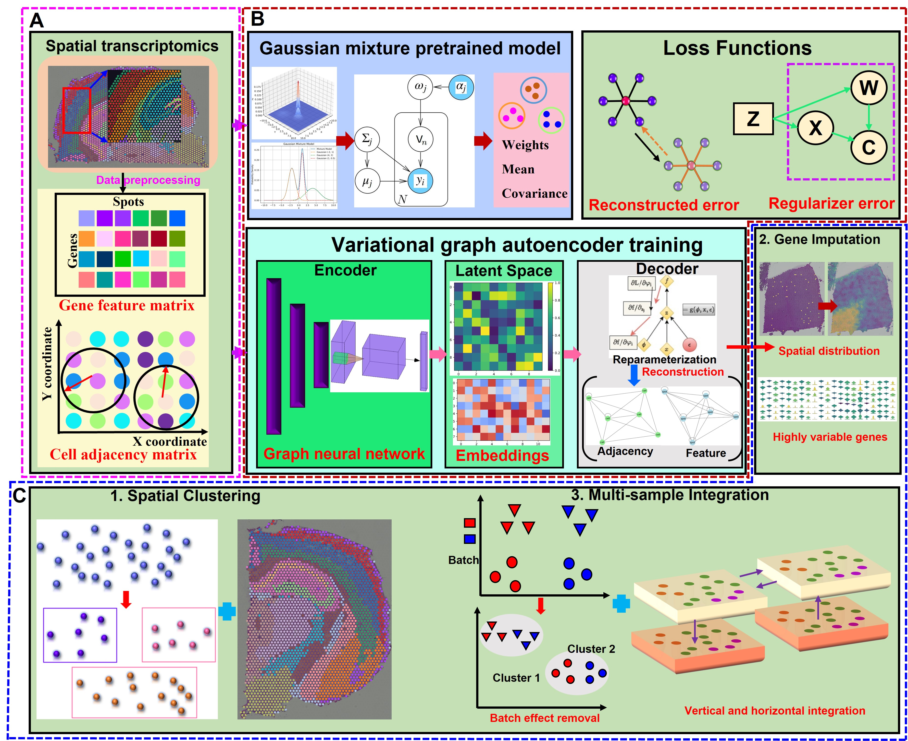

Welcome to STGMVA's documentation!
==================================

.. STGMVA documentation master file, created by
   sphinx-quickstart on Fri Jul 14 20:17:30 2023.
   You can adapt this file completely to your liking, but it should at least
   contain the root `toctree` directive.

.. toctree::
   :maxdepth: 1

   Installation
   Tutorial 1_DLPFC_151671
   Tutorial 2_Slide-seqV2-mouse olfactory bulb
   Tutorial 3_Stereo-seq-mouse olfactory bulb
   Tutorial 4_Slide-seqV2-mouse hippocampus_14 clusters
   Tutorial 5_Stereo-seq-mouse embryo E10.5_E1S3
   Tutorial 6_mouse brain_gene imputation
   Tutorial 7_mouse brain_batch_effects
   Tutorial 8_mouse brain_anterior_posterior

Overview
========
In this study, we present STGMVA, a comprehensive analysis toolkit employs a spatiotemporal gaussian mixture variational autoencoder to tackle these tasks effectively. STGMVA consists of two stages: pretraining the gene expression and spatial location using a gaussian mixture model, and learning the embedding vectors through a variational graph autoencoder. Results demonstrate STGMVA surpasses state-of-the-art approaches on various spatial transcriptomics datasets, exhibiting superior performance across different scales and resolutions. Notably, STGMVA achieves the highest clustering accuracy in human brain, mouse hippocampus, and mouse olfactory bulb tissues. Furthermore, STGMVA enhances and denoises gene expression patterns for gene imputation task. Additionally, STGMVA has the capability to correct batch effects and achieve joint analysis when integrating multiple tissue slices.

Citation
========
......